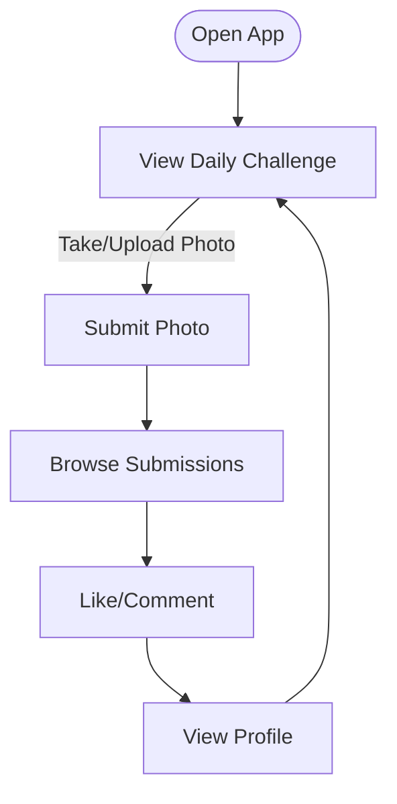

# Daily Photo Challenge App

A vibrant mobile app for daily photo sharing with timed social challenges. Users join a new themed challenge each day, upload their photos, and interact with the community.

---

## Core Features

- **Daily Challenge Feed:** See today’s prompt, browse submissions, and view past challenges.
- **Photo Submission:** Snap or upload a photo for the current challenge (one per user).
- **Social Interactions:** Like and comment on others’ photos.
- **Profile:** View your own submissions and stats.

---

## User Flow

---

## Visual Style

- **Colors:** Coral pink (#FF6B6B), turquoise (#4ECDC4), soft yellow (#FFE66D), light gray backgrounds.
- **Typography:** Inter, bold for headings, clean for body.
- **Layout:** Card-based, edge-to-edge photos, floating action button, smooth micro-animations.

---

## Edge Cases

- Empty state (no submissions yet)
- Challenge expired (can’t submit)
- Loading/error states

---

**Let’s build something beautiful and fun!**